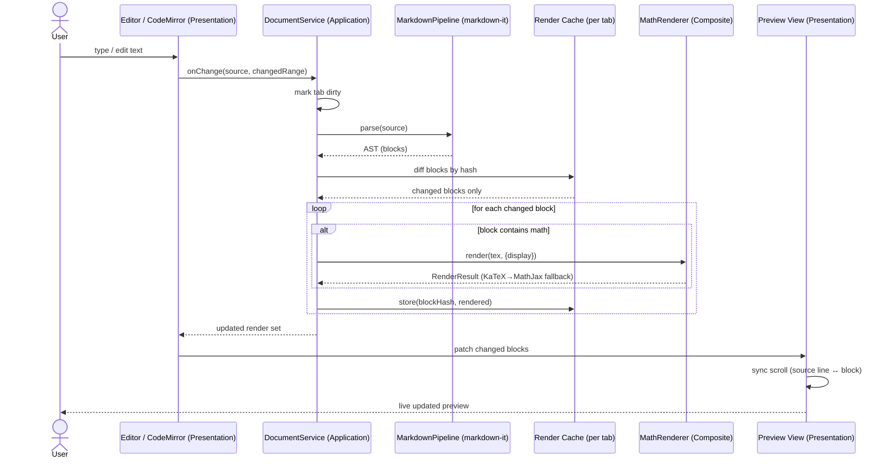

# Sequence — Edit mode: incremental live preview

```mermaid
sequenceDiagram
  actor User
  participant Editor as Editor / CodeMirror (Presentation)
  participant DocSvc as DocumentService (Application)
  participant MD as MarkdownPipeline (markdown-it)
  participant Cache as Render Cache (per tab)
  participant Math as MathRenderer (Composite)
  participant Preview as Preview View (Presentation)

  User->>Editor: type / edit text
  Editor->>DocSvc: onChange(source, changedRange)
  DocSvc->>DocSvc: mark tab dirty
  DocSvc->>MD: parse(source)
  MD-->>DocSvc: AST (blocks)

  DocSvc->>Cache: diff blocks by hash
  Cache-->>DocSvc: changed blocks only

  loop for each changed block
    alt block contains math
      DocSvc->>Math: render(tex, {display})
      Math-->>DocSvc: RenderResult (KaTeX→MathJax fallback)
    end
    DocSvc->>Cache: store(blockHash, rendered)
  end

  DocSvc-->>Editor: updated render set
  Editor->>Preview: patch changed blocks
  Preview->>Preview: sync scroll (source line ↔ block)
  Preview-->>User: live updated preview
```
