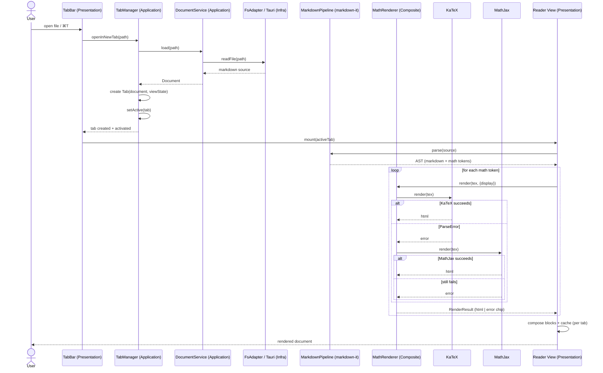

# Sequence — Open a document in a new tab (with math fallback)

```mermaid
sequenceDiagram
  actor User
  participant TabBar as TabBar (Presentation)
  participant TabMgr as TabManager (Application)
  participant DocSvc as DocumentService (Application)
  participant Fs as FsAdapter / Tauri (Infra)
  participant MD as MarkdownPipeline (markdown-it)
  participant Math as MathRenderer (Composite)
  participant KaTeX
  participant MathJax
  participant Reader as Reader View (Presentation)

  User->>TabBar: open file / ⌘T
  TabBar->>TabMgr: openInNewTab(path)

  TabMgr->>DocSvc: load(path)
  DocSvc->>Fs: readFile(path)
  Fs-->>DocSvc: markdown source
  DocSvc-->>TabMgr: Document

  TabMgr->>TabMgr: create Tab(document, viewState)
  TabMgr->>TabMgr: setActive(tab)
  TabMgr-->>TabBar: tab created + activated
  TabBar->>Reader: mount(activeTab)

  Reader->>MD: parse(source)
  MD-->>Reader: AST (markdown + math tokens)

  loop for each math token
    Reader->>Math: render(tex, {display})
    Math->>KaTeX: render(tex)
    alt KaTeX succeeds
      KaTeX-->>Math: html
    else ParseError
      KaTeX-->>Math: error
      Math->>MathJax: render(tex)
      alt MathJax succeeds
        MathJax-->>Math: html
      else still fails
        MathJax-->>Math: error
      end
    end
    Math-->>Reader: RenderResult (html | error chip)
  end

  Reader->>Reader: compose blocks + cache (per tab)
  Reader-->>User: rendered document
```
